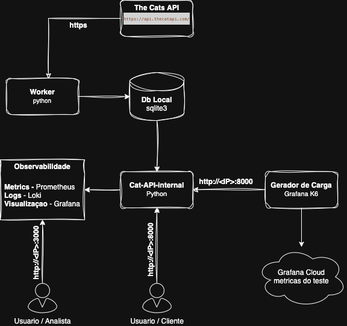

# cats-api - Case Itau

# Introduçao

A soluçao a seguir tem como base a API Publica The Cats API https://thecatapi.com/, na qual é consumido os dados conforme a solicitação a seguir:

- Para cada uma das raças de gatos disponíveis, armazenar as informações de origem, temperamento e descrição em uma base de dados. (se disponível)  
-  Para cada uma das raças acima, salvar o endereço de 3 imagens em uma base de dados. (se disponível)  
-  Salvar o endereço de 3 imagens de gatos com chapéu.  
-  Salvar o endereço de 3 imagens de gatos com óculos.

Todos os dados são commitados em um banco de dados local em formato de arquivo para posteriormente serem consumidos pela nova API.

A API interna, aqui denominada de ```cat-api```, consome essa base de dados e tem em si, as seguintes capacidades:

- listar todas as raças
- listar as informações de uma raça
- A partir de um temperamento listar as raças
- A partir de uma origem listar as raças

Todos os metodos dessa API expõe metricas de execução para o **Prometheus**, assim como tambem gera os logs, onde há um agent do **promtail** escutando o arquivo e enviando para o **Grafana Loki**. 

Todos esses dados de Observabilidade podem ser visualizados pelo Grafana a partir de uma URL descrita nessa doc.

Existe uma peça a parte para execução da carga para testar a API gerando metricas e logs para a validaçao da mesma pelo grafana.

---

# Arquitetura

Seguem um diagrama basico da soluçao



---

# Ferramentas e serviços utilizados


- **Linguagem.:** Python com FastAPI e bash

- **Database.:** Sqlite3

- **API Publica.:** The Cats API

- **Container.:** Docker / docker-compose

- **Metricas.:** Prometheus

- **Logs.:** Loki

- **Visualizaçao.:** Grafana

- **Gerador de carga.:** Grafana K6

## Acessos ao serviço cat-api

Endpoint API = [http://3.20.164.233:8000/](http://<IP>:8000/)
Grafana da API = [Dashbord - Cat Api](http://3.20.164.233:3000/)

Grafana do teste de carga = [Dashbord - Prometheus K6]( https://jrlabs.grafana.net/d/ccbb2351-2ae2-462f-ae0e-f2c893ad1028/k6-prometheus?orgId=1&from=now-3h&to=now&timezone=browser&var-DS_PROMETHEUS=&var-testid=&var-quantile_stat=&var-adhoc_filter=)

---

# Documentaçao da API

> **ℹ️ Info:** 
>Aqui, vale ressaltar que, um dos motivos da escolha do uso do FastAPI é que ele por padrão já expôe o ```/docs``` com o swagger como documentaçao da API e por ele mesmo é possivel fazer alguns testes nos metodos da API.


## Principais Endpoints

1. **Listar Todas as Raças**

    - **GET** ```/breeds```
    - **Descrição:** Retorna todas as raças de gatos disponíveis

Exemplo de sucesso:

```json
[
  {
    "id": "beng",
    "name": "Bengal",
    "origin": "United States",
    "temperament": "Alert, Agile, Energetic",
    "description": "Bengals are a lot of fun..."
  }
]
```

2. **Obter Raça por ID**

    - **GET** ```/breeds/{breed_id}```
    - **Parâmetros**:

        breed_id: ID da raça (ex: "*beng*")

**Exemplo de resposta com sucesso:**
```json
{
  "id": "beng",
  "name": "Bengal",
  "origin": "United States",
  "temperament": "Alert, Agile, Energetic",
  "description": "Bengals are a lot of fun..."
}

```

3. **Buscar por Temperamento**

    - **GET** ```/breeds/by-temperament/{temperament}```
    - **Parâmetros**:

        temperament: Traço de personalidade (ex: "*Agile*")

**Exemplo de resposta com sucesso:**
```json
[
  {
    "id": "beng",
    "name": "Bengal",
    "temperament": "Alert, Agile, Energetic"
  }
]
```

4. **Buscar por Origem**

    - **GET** ```/breeds/by-origin/{origin}```
    - **Parâmetros**:

        origin: País de origem (ex: "U*nited States*")

**Exemplo de resposta com sucesso:**
```json
[
  {
    "id": "beng",
    "name": "Bengal",
    "origin": "United States"
  }
]
```

5. **Health Check**

    - **GET** ```/health```

**Exemplo de resposta com sucesso:**
```json
{
  "status": "healthy",
  "version": "1.0.0"
}
```

6. **Métricas Prometheus**

    - **GET** /metrics

    **Descrição:** Endpoint para coleta de métricas pelo Prometheus


### Collection para o Insomnia

[Baixar coleção Insomnia (catApi_insomnia.yaml)](catApi_insomnia.yaml)

Basta importar no insomnia do seu ambiente.

---


# Prints dos pontos de Observabildiade

Aqui uns prints do grafana no que tange a observabilidade(ainda que basica) da api


---

# Como executar no ambiente local

Considerando que ja possua docker e docker-compose no seu ambiente, siga os passos

1. Clone o repositorio

2. Gere a sua API_KEY no [The Cats API](https://thecatapi.com/)

3. Insira sua chave no arquivo ```docker-compose.yml``` no serviço ```cat-api```, em ```environments:```

4. A partir do mesmo nivel de diretorio do ```docker-compose.yml```, execute:

```bash
docker-compose up -d
``` 

Aguarde todos os serviços ficarem com o status **UP**
Exemplo:
execute:
```bash
docker ps
```

A Saida do comando deve ser algo parecido com essa imagem:


Tudo executado com sucesso, as URL's devem ser:

Endpoint api = ```http://localhost:8000/```

Grafana = [http://localhost:3000](http://localhost:3000/)
user=admin
password=admin

Na arvore de diretorio do ```grafana/provisioning``` há dois diretorios:
- **dashboard/**
  Arquivo json com o template do dashboard usado.
- **datasources/**
  arquivo ```.yml``` para a configuracao do datasource do **loki** e **prometheus**

---

# Testes com carga

No diretorio de test, há um arquivo chamado ```load_test.js```, esse script em javascript foi desenvolvido para gerar uma carga na API para podermos vermos o seu funcionamento e observar seu comportamento pelo grafana.

Pode-se alterar os parametros do teste, porem nesse momento infelizmente tem de ser direto no script js, aqui encontra um ponto de melhoria para tirar do script esses parametros. Para isso altere o trecho do codigo abaixo:

```javascript
export const options = {
  stages: [
    { duration: '2m', target: 25 },  // Ramp up para 25 usuários em 5 minutos
    { duration: '3m', target: 50 }, // Ramp up para 50 usuários
    { duration: '3m', target: 100 }, // Ramp up para 100 usuários
    { duration: '3m', target: 150 }, // Ramp up para 150 usuários
    { duration: '3m', target: 200 }, // Pico de 200 usuários
    { duration: '3m', target: 0 },   // Ramp down gradual
  ],
  thresholds: {
    http_req_failed: ['rate<0.01'],  // Menos de 1% de falhas
    http_req_duration: ['p(95)<500'], // 95% das requisições abaixo de 500ms
  },
  ext: {
    loadimpact: {
      projectID: 12345,
      name: 'Cat API load Test'
    }
  }
};
```

> **ℹ️ Info:** 
> Dependendo do cenario que a API foi feito o deploy, pode haver uma contançao das requesiçoes, logo não ajuda muito aumentar os valores dos parametros. Nesse caso, eu obtive status 429 do prometheus(modo remote-write) que estou usando no grafana cloud, em alguns momentos no teste eu atingi o rate limit dessa minha conta que é free.


O componente responsavel pela sua execução é o Grafana K6.

Caso nao tenha o K6 instalado, pode-se instalar dessa forma para Macos e Windows

**Windows**
  
- Acesse: https://grafana.com/grafana/download?platform=windows&product=k6
- Baixe o arquivo .zip para Windows.
- Extraia o conteúdo em uma pasta de sua preferência.
- Adicione o caminho da pasta extraída à variável de ambiente PATH para usar o comando k6 no terminal (Prompt de Comando ou PowerShell).

Depois disso, você pode rodar k6 version para verificar se a instalação foi concluída com sucesso.

**MacOs**

```bash
brew install k6
```

Crie as seguintes variaveis de ambiente:
```bash
export K6_PROMETHEUS_RW_SERVER_URL=https://prometheus-prod-13-prod-us-east-0.grafana.net/api/prom/push
export K6_PROMETHEUS_RW_USERNAME=1234107
export K6_PROMETHEUS_RW_PASSWORD=glc_eyJvIjoiMjEyMDQ5IiwibiI6InN0YWNrLTc2MzEyOS1obS13cml0ZS1jYXNlX2l0YXUiLCJrIjoiTzhhMmZ1VDEyNjNrWlhpMDg3cjhCQndHIiwibSI6eyJyIjoicHJvZC11cy1lYXN0LTAifX0=
```

A partir do diretorio ```tests```, execute:

```bash
k6 run load_test.js  -o experimental-prometheus-rw
```

caso queira tambem ver um report local com um dashboard bem bacana, pode executar dessa forma abaixo, passando ```K6_WEB_DASHBOARD=true``` que ele vai jogar no saida do comando a URL local para acessa-lo.

```bash
K6_WEB_DASHBOARD=true k6 run load_test.js  -o experimental-prometheus-rw
```

---

